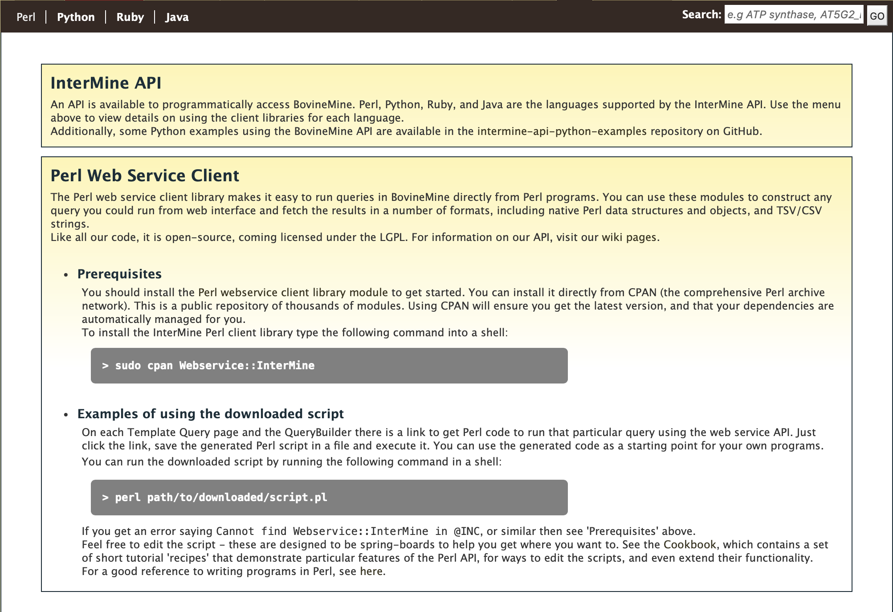

API
===

An API is available for users who would like to programmatically access BovineMine. 

  API page on BovineMine

  ..

Perl, Python, Ruby, and Java are the languages supported by the InterMine API. Several Python examples for BovineMine are available on GitHub `here <https://github.com/elsiklab/intermine-api-python-examples/tree/main/bovinemine>`_.

For more detailed information, view the `InterMine documentation <https://intermine.readthedocs.io/en/latest/web-services>`_.

..
